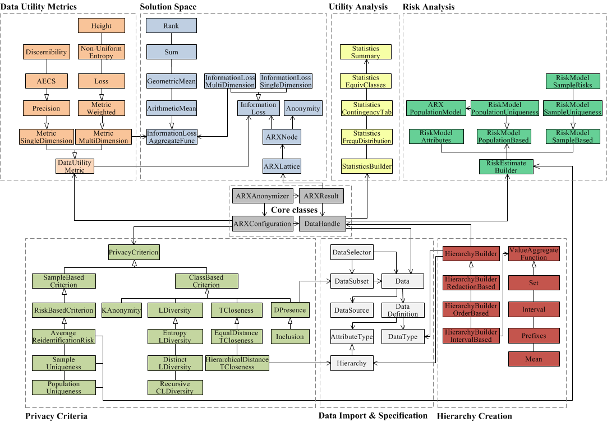

# ARX API Architecture

## Introduction

ARX is an open source tool that helps to protect personal data by transforming structured datasets using various privacy models and data transformation schemes. The tool can remove direct identifiers and enforce constraints on indirect identifiers, which can be used for linkage attacks. ARX also supports methods to protect sensitive attributes and semantic privacy models that require fewer assumptions about attackers.

ARX allows almost any combination of privacy models and data transformation schemes, such as global and local transformation schemes, random sampling, generalization, record, attribute and cell suppression, microaggregation, top- and bottom-coding, and categorization. It also supports various data quality models and objective functions to measure the data granularity, deviation in value distributions, uniqueness and ambiguity of records, and suitability of output data for classification models.

ARX provides methods to create data transformation rules, analyze data utility, estimate re-identification risks, identify quasi-identifying variables, and iteratively adjust anonymization parameters in a semi-automated process.

## API Documentation

ARX API was selected for the purpose of anonymizing data due to its well-structured code and ease of use. Additionally, it comes with comprehensive documentation, including an online javadoc with all the packages and classes in the API. The main objective of this programming interface is to offer de-identification techniques to other software systems. When it comes to the anonymization process, the key classes include `ARXConfiguration`, `ARXAnonymizer`, and `ARXResult`.



The `ARXConfiguration` is responsible for setting various parameters (e.g. privacy model, suppression rate) that are sent to the `ARXAnonymizer`. By allowing multiple parameters, users can create customized de-identified datasets. The `ARXAnonymizer` provides various methods for defining these parameters and executing the ARX algorithm based on the configuration provided by `ARXConfiguration`. The resulting output is of the type `ARXResult`, which is then presented to the user. Additionally, the `ARXResult` class includes several useful methods, such as information about execution time and information loss.

## Roadmap

1. Set up a Jetty web server: To set up a Jetty web server, I added the Jetty Maven plugin to my project's `pom.xml` file, and then configured the plugin to start Jetty when I run the project. Here's an example `pom.xml` file:

```xml
<project>
  <modelVersion>4.0.0</modelVersion>
  <groupId>com.example</groupId>
  <artifactId>anonymization-backend</artifactId>
  <version>1.0.0</version>

  <dependencies>
    <dependency>
      <groupId>org.eclipse.jetty</groupId>
      <artifactId>jetty-server</artifactId>
      <version>9.4.42.v20210604</version>
    </dependency>
    <dependency>
      <groupId>org.eclipse.jetty</groupId>
      <artifactId>jetty-servlet</artifactId>
      <version>9.4.42.v20210604</version>
    </dependency>
    <dependency>
      <groupId>org.deidentifier.arx</groupId>
      <artifactId>arx</artifactId>
      <version>3.6.1</version>
    </dependency>
  </dependencies>

  <build>
    <plugins>
      <plugin>
        <groupId>org.eclipse.jetty</groupId>
        <artifactId>jetty-maven-plugin</artifactId>
        <version>9.4.42.v20210604</version>
        <configuration>
          <httpConnector>
            <port>8080</port>
          </httpConnector>
          <webApp>
            <contextPath>/</contextPath>
          </webApp>
        </configuration>
      </plugin>
    </plugins>
  </build>
</project>
```

This pom.xml file includes dependencies for Jetty, the ARX library, and sets up the Jetty Maven plugin to start Jetty on port 8080.

2. Integrate ARX API into the Java backend: I can use the same Java code as in the previous example to integrate the ARX API into my Jetty-based backend.

3. Expose the ARX API as a web service: To expose the ARX API as a web service, I need to define a servlet that listens for HTTP requests and returns the anonymized data as a response. Here's an example servlet:

```java
public class AnonymizationServlet extends HttpServlet {
    @Override
    protected void doPost(HttpServletRequest req, HttpServletResponse resp) throws ServletException, IOException {
        // Parse the input data as a CSV file
        CSVParser parser = CSVParser.parse(req.getInputStream(), CSVFormat.DEFAULT);

        // Create an ARX data definition based on the input data
        DataDefinition dataDefinition = DataDefinition.createDefinition();
        for (int i = 0; i < parser.getHeaderMap().size(); i++) {
            dataDefinition.addColumn(parser.getHeaderMap().get(i), DataTypes.STRING);
        }

        // Create an ARX configuration with generalization and suppression rules
        ARXConfiguration config = ARXConfiguration.create();
        config.addPrivacyModel(new KAnonymity(2));
        config.addPrivacyModel(new LDiversityDistinct(2, "sensitive_attribute"));
        config.addPrivacyModel(new TClose(0.5));
        config.setSuppressionLimit(0.02d);

        // Create an ARX anonymizer and anonymize the data
        ARXAnonymizer anonymizer = new ARXAnonymizer();


        // anonymize the data
        ARXResult result = anonymizer.anonymize(dataDefinition, config, parser.iterator());

        // Convert the anonymized data to a CSV file
        StringWriter writer = new StringWriter();
        CSVPrinter printer = new CSVPrinter(writer, CSVFormat.DEFAULT.withHeader(parser.getHeaderMap().values().toArray(new String[0])));
        for (Object[] row : result.getOutput()) {
            printer.printRecord(row);
        }
        printer.flush();

        // Set the content type and write the anonymized data to the response
        resp.setContentType("text/csv");
        resp.getWriter().write(writer.toString());
    }
}
```
This servlet listens for POST requests, expects the input data as a CSV file in the request body, and returns the anonymized data as a CSV file in the response body.

4. Start the Jetty server: Finally, I can start the Jetty server by running the following command in my project directory:

```bash
mvn jetty:run
```

This command starts Jetty and deploys my web application on port 8080. I can then send HTTP requests to `http://localhost:8080/anonymize` with input data as a CSV file, and receive anonymized data as a CSV file in response.

That's it! With this setup, I have a web service that exposes the ARX API and can be easily integrated into a React web app or any other client that can send HTTP requests.
