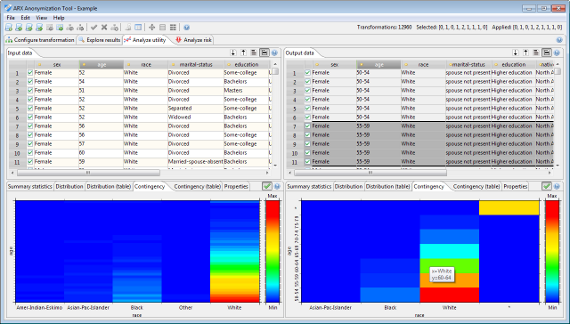

# ARX 

Link: [ARX Data Anonymization Tool](https://arx.deidentifier.org/)
## Introduction
ARX is a state-of-the-art data anonymization tool designed to help organizations comply with data protection regulations while enabling them to share and analyze their data. ARX was developed to provide a high-accuracy data anonymization solution that can be used in a wide range of applications, from scientific research to healthcare data management.

## Features
Support multiple anonymization techniques, including k-anonymity, l-diversity, t-closeness, and b-likeness.
ARX can be used for up to 50 dimensions, allowing for a high level of granularity when anonymizing data.
ARX uses a combination of statistical and machine learning techniques to ensure high accuracy in the anonymization process. The tool uses data anonymization algorithms that are designed to minimize information loss while also providing robust privacy protection.
ARX offers a user-friendly graphical interface that makes it easy for users to anonymize their data. The interface provides a visual representation of the data being anonymized, allowing users to see the impact of the anonymization process and adjust the parameters to suit their needs.

## Working Process

ARX is a data anonymization tool that uses privacy models, data transforming methods, and data analysis methods to transform sensitive personal data into anonymous data. The privacy models used in ARX are designed to provide privacy protection to the data while preserving its usefulness for research or analysis purposes.

ARX works in the following steps:

Load Data: The first step is to load the data into the ARX software. The data can be in any format such as CSV, XML, or SQL databases.

Select Privacy Models: ARX offers a variety of privacy models, such as k-anonymity, l-diversity, t-closeness, and d-presence. The user selects the desired privacy model that suits their needs and protects the privacy of the data.

Data Transformation: ARX uses various data transforming methods, such as generalization, suppression, and randomization, to anonymize the data. The user can adjust the parameters of the data transforming methods to get the desired level of anonymity and protection.

Data Analysis: ARX provides various methods for analyzing the data and evaluating the quality of the output. This includes methods for evaluating the risk of re-identification and the loss of information.

## Use Cases

Clinical Trial Data Sharing: ARX can be used to anonymize sensitive patient data in clinical trials, allowing researchers to share the data while protecting the privacy of patients.

Commercial Big Data Analytics: ARX can be used by big data analytics companies to anonymize sensitive personal data in order to perform research and analysis while satisfying privacy regulations.

Research Projects: ARX is widely used in research projects to anonymize sensitive personal data while preserving the data's usefulness for research purposes.

Training Purposes: ARX can also be used for training purposes, to teach individuals about privacy protection and data anonymization methods.

## Conclusion
ARX is a highly flexible and user-friendly data anonymization tool that provides robust privacy protection for organizations that need to share and analyze their data. With its support for multiple anonymization techniques and its ability to handle up to 50 dimensions, ARX is a powerful solution for data protection and data sharing. Additionally, its high accuracy and user-friendly graphical interface make it easy to use, even for users with little to no technical background.
